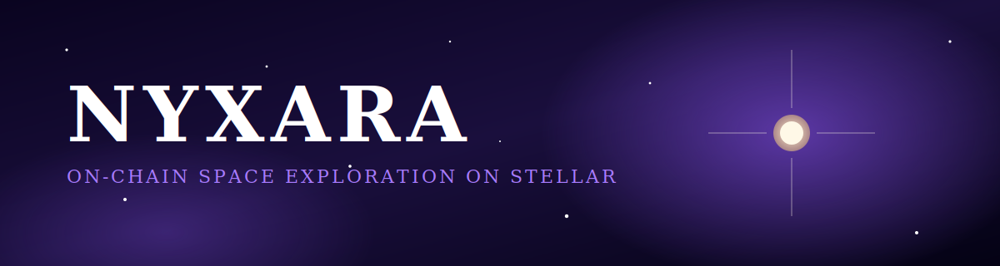
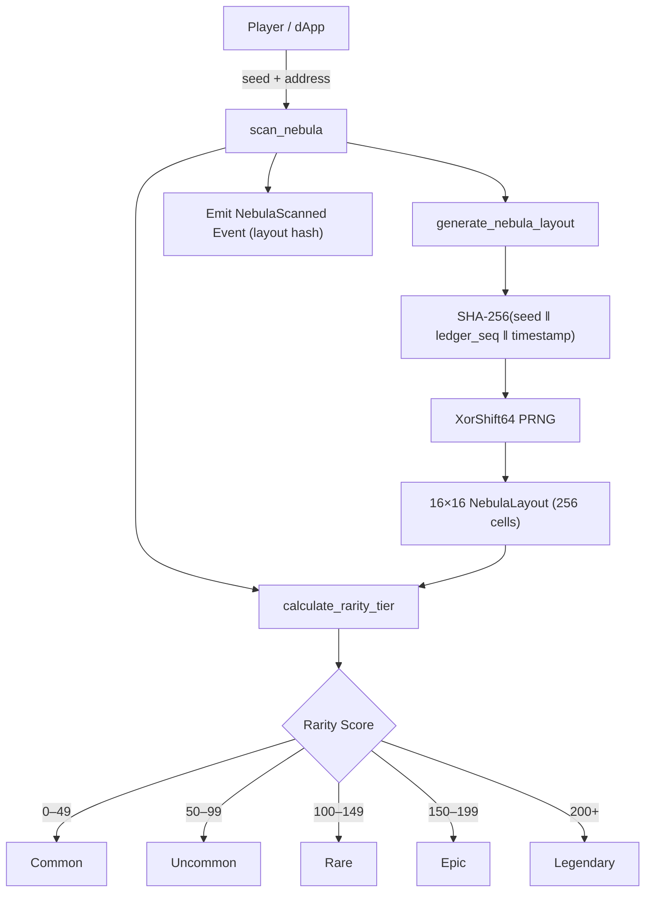
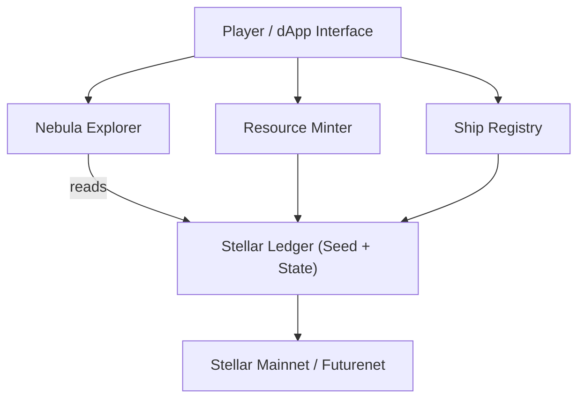
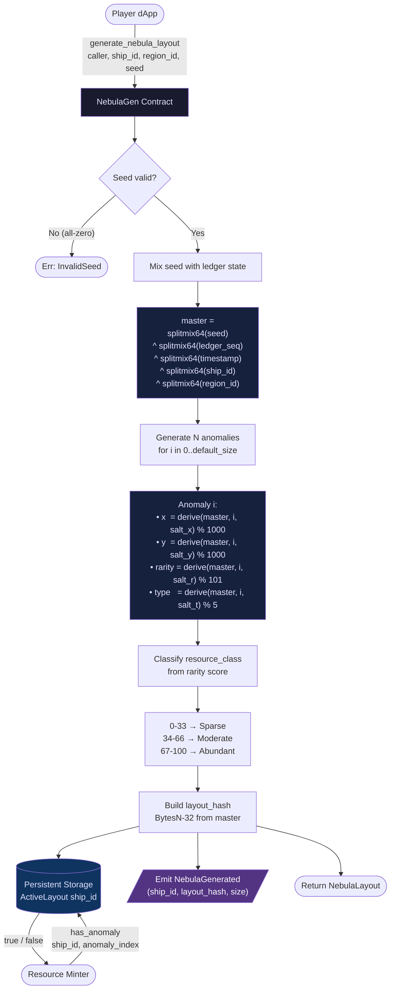

<p align="center">
  
</p>

<h1 align="center">Nyxara</h1>

<p align="center">
  <em>On-chain space exploration on Stellar. Scan procedurally generated nebulae, mint resources, own your ships.</em>
</p>

<p align="center">
  <a href="https://github.com/noctics-labs/Nyxara/actions"></a>
  <a href="https://github.com/noctics-labs/Nyxara/blob/main/LICENSE"></a>
  
  
</p>

<p align="center">
  <a href="#features">Features</a> ·
  <a href="#architecture">Architecture</a> ·
  <a href="#getting-started">Getting started</a> ·
  <a href="#contributing">Contributing</a>
</p>

---


## 🌌 Project Overview

**Nyxara** is a decentralized space exploration simulation built on Stellar using Soroban smart contracts. Players explore procedurally generated nebula regions, collect resources, upgrade their explorer ships (NFTs), and participate in a chill, exploration-focused Web3 gaming experience. Unlike traditional competitive games, Nyxara emphasizes discovery, customization, and cooperation—no combat, no pay-to-win, just endless cosmic adventures.

### Why Nyxara?

- **Ledger-Seeded Procedural Generation**: Every nebula scan uses Soroban ledger data as a seed, ensuring deterministic, verifiable procedural generation that's impossible to manipulate.
- **True Ownership**: Explorer ships are registered as Soroban native tokens, giving players true digital ownership without relying on centralized databases.
- **Resource Economy**: Collected resources can be minted and traded on secondary markets, creating a dynamic player-driven economy.
- **Stellar Ecosystem Impact**: Demonstrates Soroban's capability for complex gaming logic, encouraging developers to build Web3 games on Stellar instead of other blockchains.
- **Accessible & Fair**: Anyone with a Stellar account can play—no gatekeeping, no initial investment required beyond network fees.

### Tech Stack

- **Language**: Rust with Soroban SDK
- **Blockchain**: Stellar Soroban (layer-1 smart contracts)
- **Network**: Stellar Mainnet & Futurenet (testnet)
- **Build System**: Cargo (Rust package manager)
- **Deployment**: Soroban CLI v20.0+

---

## ✨ Key Features

### Core Smart Contracts

- **Nebula Explorer Contract**
  - `scan_nebula()`: Generate procedural nebula data using ledger-seeded RNG
  - Deterministic region generation for consistency across players
  - Dynamic resource classification (sparse, moderate, abundant)

- **Resource Minter Contract**
  - `mint_resource()`: Create tradeable in-game resources
  - Supports multiple resource types (stellar dust, dark matter, exotic matter)
  - Immutable resource ledger with ownership tracking

- **Ship Registry Contract**
  - `register_ship()`: Mint explorer ship NFTs
  - `upgrade_ship()`: Enhance scanning range and capabilities
  - Level-based progression system
  - Unique ship metadata storage

- **Nomad Bonding Contract**
  - `create_bond()`: Form a multi-sig cooperative bond between two players
  - `accept_bond()`: Partner confirms the bond (Pending → Active)
  - `delegate_yield()`: Share a percentage of cosmic essence with bonded partner
  - `claim_yield()`: Beneficiary claims their delegated yield share
  - `dissolve_bond()`: Either party can end the bond
  - Full security: only bonded addresses can interact
  - See [Nomad Bonding Guide](docs/NOMAD_BONDING_GUIDE.md) for details

### Advanced Mechanics

- **Procedural Generation**: Ledger-seeded RNG ensures fair, verifiable region generation
- **NFT Ownership**: Ships stored as Soroban tokens with full transfer/trading support
- **Nomad Bonding**: Multi-sig cooperative bonds with passive yield delegation — real Web3 social mechanics
- **Resource Trading**: Collected resources can be exchanged on DEXs integrated with Stellar
- **Leaderboards**: On-chain tracking of top explorers by region coverage and resource wealth
- **Achievements**: Milestone tracking for community engagement

---

## 📖 API Documentation

The full contract API is documented in the OpenAPI 3.0 spec:

- **Interactive Swagger UI**: [`docs/api/swagger-ui/index.html`](docs/api/swagger-ui/index.html)
- **Static Redoc Reference**: [`docs/api/index.html`](docs/api/index.html)
- **OpenAPI YAML Source**: [`docs/api/openapi.yaml`](docs/api/openapi.yaml)

To generate documentation locally:

```bash
./scripts/generate-docs.sh
# Or serve interactively:
./scripts/generate-docs.sh --serve
```

---

## 🚀 Quick Start

### Prerequisites

1. **Rust 1.70+**: [Install Rust](https://rustup.rs/)

   ```bash
   curl --proto '=https' --tlsv1.2 -sSf https://sh.rustup.rs | sh
   ```

2. **Soroban CLI**: [Install Soroban CLI v20.0+](https://developers.stellar.org/learn/storing-data/soroban)

   ```bash
   cargo install soroban-cli --locked
   ```

3. **Stellar Account**: Create a testnet account at [Stellar Lab](https://lab.stellar.org) or via CLI
   ```bash
   soroban config identity create myaccount --network futurenet
   ```

### Clone & Setup

```bash
# Clone the repository
git clone https://github.com/yourorg/stellar-nyxara.git
cd stellar-nyxara

# Install dependencies
cargo build

# Run local tests
cargo test
```

### Local Testing

```bash
# Build the WASM contract
cargo build --target wasm32-unknown-unknown --release

# Run integration tests
./scripts/test.sh

# Test on local Soroban environment (requires stellar-core sandbox)
soroban contract invoke --id YOUR_CONTRACT_ID \
  --fn scan_nebula \
  --arg 12345
```

### Deploy to Futurenet

```bash
# Configure Futurenet
soroban network add --rpc-url https://rpc-futurenet.stellar.org --network-passphrase "Test SDF Future Network ; October 2024" futurenet

# Deploy contract
./scripts/deploy.sh futurenet

# Invoke a function
soroban contract invoke \
  --source-account YOUR_ACCOUNT \
  --network futurenet \
  --id CONTRACT_ADDRESS \
  --fn initialize

# Query scan results
soroban contract invoke \
  --source-account YOUR_ACCOUNT \
  --network futurenet \
  --id CONTRACT_ADDRESS \
  --fn scan_nebula \
  --arg 42
```

### Example: Your First Scan

```bash
# 1. Register your ship
soroban contract invoke \
  --id CONTRACT_ADDRESS \
  --fn register_ship \
  --arg '"GXXXXX..."' \
  --arg '"Cosmic Wanderer"' \
  --network futurenet

# 2. Scan a nebula region (region_id: 999)
soroban contract invoke \
  --id CONTRACT_ADDRESS \
  --fn scan_nebula \
  --arg 999 \
  --network futurenet

# 3. Mint resources from your scan
soroban contract invoke \
  --id CONTRACT_ADDRESS \
  --fn mint_resource \
  --arg '"GXXXXX..."' \
  --arg '"stellar_dust"' \
  --arg 50 \
  --network futurenet
```

---

## 🏗️ Architecture

### Nebula Generation Flow (Mermaid)



### Contract Interaction Diagram



### Nebula Generation Engine — Data Flow



### Module Breakdown

```
stellar-nyxara/
├── src/
│   ├── lib.rs                    # Main contract entry point
│   ├── nebula_explorer.rs        # Procedural generation logic
│   ├── nomad_bonding.rs          # Multi-sig bonding & yield delegation
│   ├── resource_minter.rs        # Resource NFT minting
│   └── ship_registry.rs          # Ship NFT management
├── tests/
│   └── integration_tests.rs      # Contract test suite (33 tests)
├── scripts/
│   ├── deploy.sh                 # Deployment automation
│   └── test.sh                   # Test runner
├── docs/
│   ├── NOMAD_BONDING_GUIDE.md    # Bonding system guide
│   └── ABI.md                    # Contract interface specs
├── examples/
│   └── scan_example.rs           # Usage examples
└── Cargo.toml                    # Rust package manifest
```

### Data Flow

1. **Player initiates scan** → Provides a 32-byte seed + authenticates via `require_auth`
2. **Entropy mixing** → Contract SHA-256 hashes: `seed ‖ ledger_sequence ‖ timestamp`
3. **Procedural generation** → XorShift64 PRNG fills a 16×16 grid of `NebulaCell` structs (type + energy)
4. **Rarity calculation** → On-chain math scores rare cell density + energy → `Rarity` enum (Common → Legendary)
5. **Event emission** → `NebulaScanned` event published with layout hash for off-chain indexing
6. **Resource minting** → Player can mint discovered resources
7. **Ownership recorded** → Stellar ledger maintains immutable history

---

## 🛠️ Development Guide

### Building from Source

```bash
# Debug build
cargo build

# Release build (optimized WASM)
cargo build --target wasm32-unknown-unknown --release

# Check code
cargo check

# Format code
cargo fmt

# Lint code
cargo clippy
```

### Testing

```bash
# Run all tests
cargo test --all

# Run with output
cargo test -- --nocapture

# Run specific test
cargo test test_nebula_scan -- --exact

# Run integration tests
cargo test --test integration_tests

# Generate test coverage (requires cargo-tarpaulin)
cargo install cargo-tarpaulin
cargo tarpaulin --out Html
```

### Deploying a Custom Network

```bash
# 1. Build the contract
cargo build --target wasm32-unknown-unknown --release

# 2. Optimize WASM size
soroban contract optimize --wasm target/wasm32-unknown-unknown/release/stellar_nebula_nomad.wasm

# 3. Deploy to network
soroban contract deploy \
  --wasm target/wasm32-unknown-unknown/release/stellar_nebula_nomad.wasm \
  --source-account YOUR_ACCOUNT_NAME \
  --network futurenet

# 4. Save contract ID for later use
export CONTRACT_ID="CXXXXX..."
```

### Debugging & Inspection

```bash
# Inspect contract WASM binary
soroban contract inspect --wasm target/wasm32-unknown-unknown/release/stellar_nebula_nomad.wasm

# View contract specification
soroban contract inspect --id CONTRACT_ID --network futurenet

# Fetch contract events
soroban contract read --id CONTRACT_ID --network futurenet
```

---

## 🤝 Contributing

We warmly welcome contributions from developers of all skill levels! Nyxara is built by the community, for the community.

### Getting Started

1. **Fork the repository** on GitHub
2. **Create a feature branch**: `git checkout -b feat/your-feature-name`
3. **Make your changes** and commit with clear messages
4. **Submit a pull request** with a detailed description
5. **Code review** by maintainers (typically within 48 hours)

### Development Workflow

```bash
# 1. Create a feature branch
git checkout -b feat/add-asteroid-mining

# 2. Make changes and test locally
cargo test

# 3. Commit with descriptive message
git commit -m "feat: add asteroid mining contract module"

# 4. Push to your fork
git push origin feat/add-asteroid-mining

# 5. Open a PR on GitHub
```

### Contribution Guidelines

- **Code Style**: Follow Rust conventions via `cargo fmt` and `cargo clippy`
- **Testing**: Add tests for all new features (target >80% coverage)
- **Documentation**: Update README and ABI docs for contract changes
- **Commits**: Use [conventional commits](https://www.conventionalcommits.org/) (feat:, fix:, docs:, etc.)
- **Issues**: Check existing issues before opening new ones
- **Discussion**: Use GitHub Discussions for feature ideas before implementing

### Areas We Need Help With

- **Smart Contract Enhancements**: Advanced procedural generation, game mechanics
- **Testing**: Integration test expansion, property-based testing
- **Documentation**: API docs, tutorial videos, architecture diagrams
- **Deployment**: Mainnet deployment guides, infrastructure-as-code
- **Tooling**: CLI improvements, explorer integrations
- **Community**: Community guides, Discord moderation, content creation

### Issue Templates

When reporting bugs, please use our [issue template](https://github.com/yourorg/stellar-nyxara/issues/new?template=bug_report.md):

```markdown
### Describe the bug

Brief description of the issue

### Steps to reproduce

1. Run command X
2. Observe Y
3. Unexpected result Z

### Expected behavior

What should happen

### Environment

- OS: [e.g., macOS 13]
- Rust version: [output of `rustc --version`]
- Soroban CLI version: [output of `soroban --version`]

### Additional context

Any other relevant information
```

---

## 📋 Code of Conduct

This project adheres to the **Contributor Covenant Code of Conduct**. By participating, you agree to uphold this code.

### Our Commitment

We are committed to providing a welcoming and inspiring community for all. We expect all participants to:

- **Be respectful**: Value diverse perspectives and experiences
- **Be inclusive**: Welcome newcomers and those learning
- **Be professional**: Maintain constructive communication
- **Be supportive**: Help others and share knowledge

### Unacceptable Behavior

Harassment, discrimination, and other inappropriate conduct will not be tolerated. This includes:

- Offensive comments related to identity or experience
- Deliberate intimidation or threats
- Unwanted sexual advances or attention
- Doxxing or publishing private information
- Any other conduct that violates community standards

### Reporting

If you witness or experience unacceptable behavior, please report it to the maintainers at [email@example.com]. All reports are confidential.

**Full Code of Conduct**: [Contributor Covenant v2.1](https://www.contributor-covenant.org/version/2/1/code_of_conduct/)

---

## 📚 Architecture Overview

### Ledger-Seeded Procedural Generation

Nyxara uses Soroban's ledger sequence number as a source of entropy for procedural generation:

```
region_id ⊕ ledger_sequence → seed
seed % 100 → density (0-100)
seed % 4 → color selection
density range → resource classification
```

**Benefits**:

- Deterministic: Same region always generates same properties
- Fair: No server-side manipulation possible
- Verifiable: Any player can reproduce results
- Efficient: Minimal on-chain computation

---

## 📦 Deployment

### Mainnet Deployment Checklist

- [ ] Audit smart contracts for security
- [ ] Set up monitoring and alerting
- [ ] Deploy to Testnet first
- [ ] Conduct load testing
- [ ] Plan rollback procedure
- [ ] Schedule network maintenance window
- [ ] Announce deployment timeline to community
- [ ] Deploy contracts
- [ ] Verify all functions operational
- [ ] Monitor for 24+ hours

### Environment Variables

```bash
# .env file (never commit to git)
SOROBAN_NETWORK=mainnet
SOROBAN_RPC_URL=https://rpc-mainnet.stellar.org
SOURCE_ACCOUNT=myaccount
DEPLOY_TIMEOUT=300
```

---

## 🔗 Resources & Links

- **Stellar Docs**: https://developers.stellar.org
- **Soroban Guide**: https://developers.stellar.org/learn/storing-data/soroban
- **Stellar Lab**: https://lab.stellar.org (account & transaction tools)
- **Soroban CLI**: https://github.com/stellar/rs-soroban-cli
- **Community Discord**: https://discord.gg/stellar
- **Forum**: https://stellar.community

### Related Projects

- [Soroban Examples](https://github.com/stellar/soroban-examples)
- [Futurenet Documentation](https://developers.stellar.org/docs/soroban/learn/setup)

---

## 📈 Roadmap

### Phase 1: Foundation ✅ (Q1 2026)

- [ ] Core contract deployment
- [ ] Nebula scanning system
- [ ] Resource minting
- [ ] Ship registration & upgrades

### Phase 2: Expansion (Q2 2026)

- [x] Nomad Bonding System (multi-sig co-op yield sharing)
- [ ] Multi-contract coordination
- [ ] Advanced upgrade system
- [ ] Leaderboard smart contract
- [ ] Achievement tracking
- [ ] Community governance token

### Phase 3: Ecosystem (Q3 2026)

- [ ] DEX integration for resource trading
- [ ] Mobile app integration
- [ ] NFT marketplace interoperability
- [ ] Third-party dApp integrations
- [ ] Web3 gaming partnerships

### Phase 4: Scale (Q4 2026+)

- [ ] Layer-2 scaling (if needed)
- [ ] Cross-chain bridges
- [ ] Advanced AI procedural generation
- [ ] Multiplayer cooperative events
- [ ] DAO governance transition

---

## 🏆 Acknowledgments

Nyxara exists thanks to:

- **Stellar Foundation**: For the incredible Stellar protocol and ongoing developer support
- **Soroban Team**: For building production-ready smart contracts on Stellar
- **Open Source Community**: For inspiration and incredible Rust tooling
- **Early Contributors**: For testing, feedback, and development support
- **Players & Explorers**: For venturing into the nebula and supporting the vision

### Special Thanks

We'd like to thank everyone who has contributed bug reports, suggestions, or code. Check out our [contributors page](https://github.com/yourorg/stellar-nyxara/graphs/contributors) to see all amazing folks involved.

---

## 📄 License

Nyxara is released under the **MIT License**. See [LICENSE](LICENSE) for full details.

### What This Means

✅ **You can**: Use, modify, and distribute this software for any purpose (personal, commercial, academic)
✅ **You must**: Include a copy of the license and copyright notice
⚠️ **No warranty**: The software is provided as-is without guarantees

---

## 📞 Support

### Getting Help

- **Documentation**: See [docs/](docs/) folder
- **Examples**: Check [examples/](examples/) folder
- **Issues**: [GitHub Issues](https://github.com/Space-Nebula/stellar-nyxara/issues)
- **Discussions**: [GitHub Discussions](https://github.com/Space-Nebula/stellar-nyxara/discussions)
- **Discord**: [Stellar Community Discord](https://discord.gg/stellar)

### Security Issues

If you discover a security vulnerability, **please do not open a public issue**. Instead, email security@example.com with:

- Description of the vulnerability
- Steps to reproduce
- Potential impact
- Suggested fix (if any)

**Built by the Nyxara community**


---

## Auto-generated contribution

Added by bounty bot.
